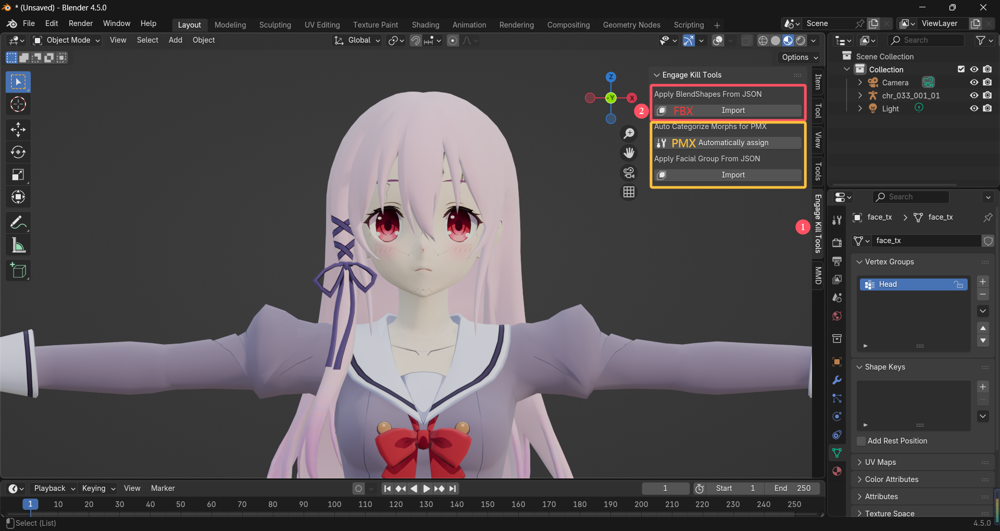
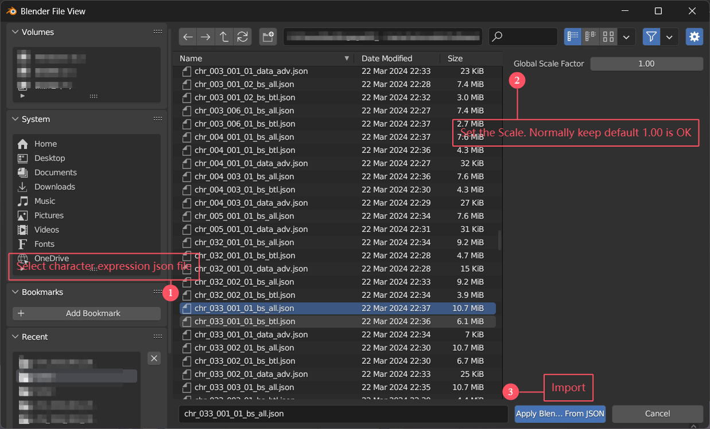
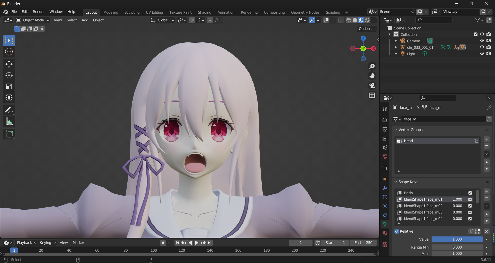

# Engage Kill Character Model Expression Repair Blender Addon

中文Readme请点击[这里](README.zh-CN.md)

## 1. Why

When exporting game models as FBX files, **facial expressions are not preserved**. The actual vertex offsets for expressions are exported as JSON files (`_bs_all.json` and `_bs_btl.json`) in the same directory as the model.  

This addon **adds expressions as shape keys** to the model using data from these JSON files.

## 2. How to Use

### 1) Addon Installation
- Place the addon folder in Blender's `\scripts\addons\` directory,  
  **OR**  
- Use `Edit > Preferences... > Add-ons > Install...` to select the ZIP file and enable the addon.

### 2) Addon Usage
#### **a. Import Character Model**  
Typically located in:  
`assets\veyron\external\assetbundleresources\character\model\chr\base\`

#### **b. Apply Expressions to Character**  

1. In the 3D Viewport, select:  
   `Object > Apply BlendShapes from JSON`  
   
2. Select the expression JSON file corresponding to the model  
 (Usually in the same directory as the model file):  
     
3. Verify shape keys are properly added:  
     

#### **c. Important Notes**  
  - **c.1** Adjust the `Global Scale Factor` during import if needed (default recommended).  

  - **c.2** Duplicate shape keys will be overwritten if re-imported.  

  - **c.3** Using JSON files from other models may cause errors due to vertex mismatches.  

  - **c.4** This addon is **exclusively for Engage Kill mobile game models**. Compatibility with other games is untested.  

  - **c.5** Languages Supported: `Simplified Chinese`, `Traditional Chinese`, `English`, `Japanese`

#### **d. Other Features**  

 **New in v1.3.0:**

1. **Automatic PMX Expression Categorization**
    Facial expressions are automatically assigned to the corresponding panels (eyes, mouth).

2. **PMX Import of Combined Expressions**
    Loads combined expression JSON files from the following directory:
    `assets/veyron/external/assetbundleresources/effect/advchr/<model_name>/`
    This import process only handles eye and mouth expressions and does not process bone rotation or external effects.

   Blender 4.0+ Support: When running in Blender 4.0 or higher, combined expressions can optionally be converted into vertex (shape‑key) expressions during import.

## 3. Credits & Disclaimer
- Code primarily generated by **DeepSeek** and optimized with **ChatGPT**.  

- Special thanks to **UnityPy community** and **QQ user "Ran Wang Yi"** for technical guidance.  

- **Engage Kill** is copyrighted by `SQUARE ENIX CO., LTD. (株式会社スクウェア・エニックス)`.  

- **Game service has terminated.** Official website: https://www.jp.square-enix.com/engage-kill/

- dependencies

  blender-addon-update	https://github.com/CGCookie/blender-addon-updater/tree/v1.1.1

