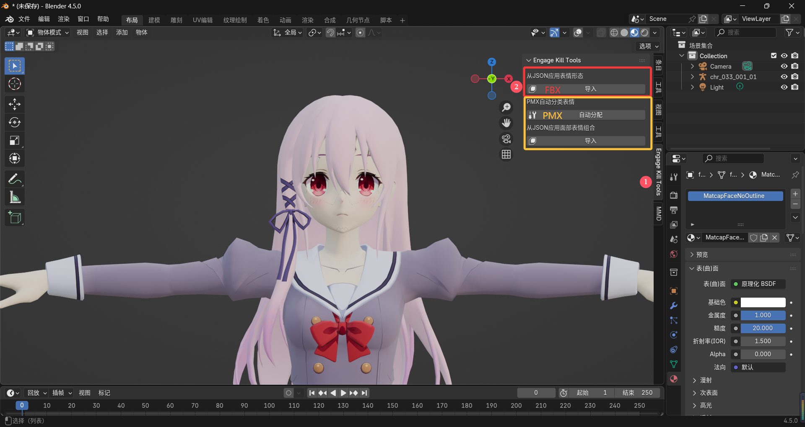
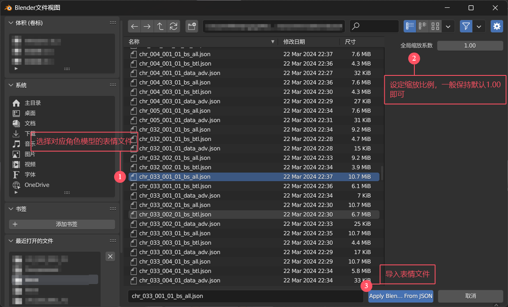
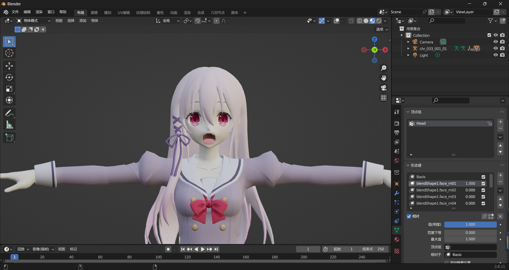

# Engage Kill 手游角色模型表情修复 Blender 插件

## 1. 插件功能说明
将游戏模型导出为 FBX 格式时，**面部表情数据不会保留在模型中**。实际的表情顶点偏移信息以 JSON 文件形式导出，存储在模型目录下的同名文件 `_bs_all.json` 和 `_bs_btl.json` 中。

本插件可将 JSON 文件中的表情数据转化为 **形态键（Shape Keys）** 添加到 Blender 模型上，实现完整的角色表情修复。

## 2. 使用指南

### 1）插件安装方法
**任选一种安装方式：**
- 将插件文件夹放入 Blender 安装目录的 `\scripts\addons\` 路径下
- 在 Blender 中使用菜单：  
  `编辑 > 偏好设置 > 插件 > 安装...`  
  选择插件 ZIP 文件进行安装，并启用插件

### 2）插件使用流程
#### a. 导入角色模型
- 模型文件通常位于游戏目录：  
  `assets\veyron\external\assetbundleresources\character\model\chr\base\`

#### b. 应用表情数据
1. **启动功能**  
   在 3D 视图中选择模型后：  
   `物体 > 从JSON应用表情形态`  
   

2. **选择表情文件**  
   选择与模型同名的 JSON 表情文件（位于相同目录）：  
   

3. **验证结果**  
   在形态键面板检查表情是否成功添加：  
   

### 3）注意事项
- **缩放参数**：导入时可调整"全局缩放系数"，通常保持默认值即可
- **重复导入**：相同名称的形态键会被覆盖更新
- **文件匹配**：请确保使用与模型匹配的JSON文件，否则可能因顶点不匹配导致表情失效
- **兼容性**：本插件专为 **Engage Kill 手游模型** 设计，未测试其他游戏
- **语言**：支持`简体中文`、`繁体中文`、`英文`、`日文`

## 3. 致谢与声明
### 开发说明
- 插件代码主要由 **DeepSeek** 生成
- 经 **ChatGPT** 优化完善
- 特别感谢 **UnityPy 社区** 的技术支持
- 感谢 **QQ 用户"燃王翼"** 的指导

### 版权声明
**Engage Kill** 手游版权归属：  
`SQUARE ENIX CO., LTD. (株式会社スクウェア・エニックス)`  

游戏已停止运营，官方网站：  
[https://www.jp.square-enix.com/engage-kill/](https://www.jp.square-enix.com/engage-kill/)

**dependencies**

[CGCookie]: https://github.com/CGCookie/blender-addon-updater/tree/v1.1.1	"blender-addon-update"

