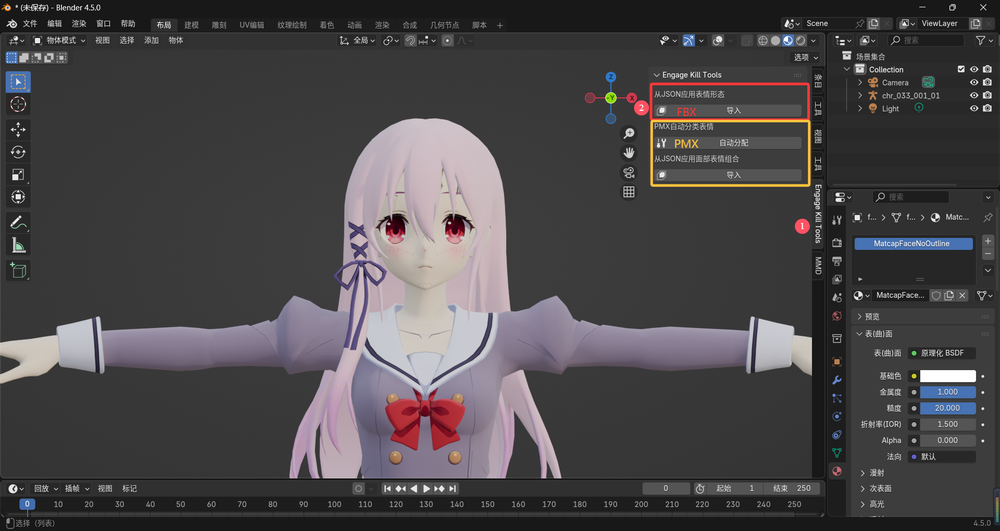
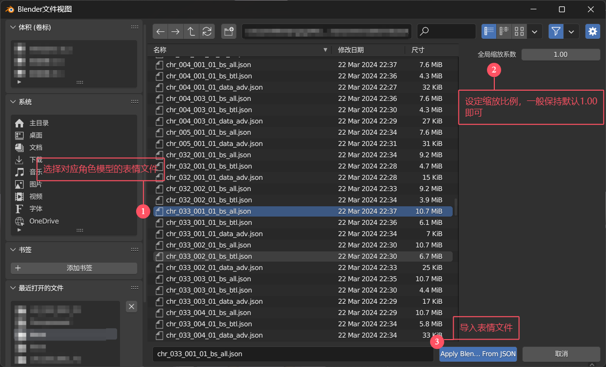
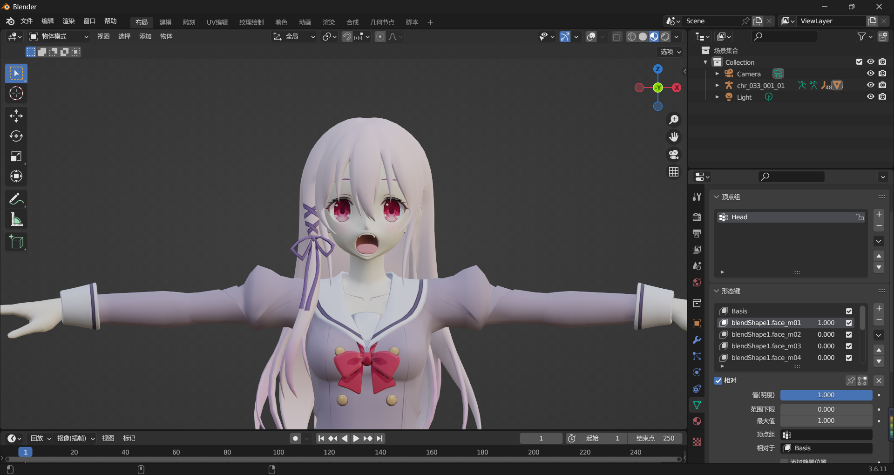

# Engage Kill 手游角色模型表情修复 Blender 插件

## 1. 插件功能说明
将游戏模型导出为 FBX 格式时，**面部表情数据不会保留在模型中**。实际的表情顶点偏移信息以 JSON 文件形式导出，存储在模型目录下的同名文件 `_bs_all.json` 和 `_bs_btl.json` 中。

本插件可将 JSON 文件中的表情数据转化为 **形态键（Shape Keys）** 添加到 Blender 模型上，实现完整的角色表情修复。

## 2. 使用指南

### 1）插件安装方法
**任选一种安装方式：**
- 将插件文件夹放入 Blender 安装目录的 `\scripts\addons\` 路径下
- 在 Blender 中使用菜单：  
  `编辑 > 偏好设置 > 插件 > 安装...`  
  选择插件 ZIP 文件进行安装，并启用插件

### 2）插件使用流程
#### a. 导入角色模型
- 模型文件通常位于游戏目录：  
  `assets\veyron\external\assetbundleresources\character\model\chr\base\`

#### b. 应用表情数据
1. **启动功能**  
   在 3D 视图中选择模型后：  
   `物体 > 从JSON应用表情形态`  
   

2. **选择表情文件**  
   选择与模型同名的 JSON 表情文件（位于相同目录）：  
   

3. **验证结果**  
   在形态键面板检查表情是否成功添加：  
   

### 3）注意事项
- **缩放参数**：导入时可调整"全局缩放系数"，通常保持默认值即可

- **重复导入**：相同名称的形态键会被覆盖更新

- **文件匹配**：请确保使用与模型匹配的JSON文件，否则可能因顶点不匹配导致表情失效

- **兼容性**：本插件专为 **Engage Kill 手游模型** 设计，未测试其他游戏

- **语言**：支持`简体中文`、`繁体中文`、`英文`、`日文`

### 4）其他功能

**v1.3.0新增：**

1. PMX自动分类表情：将表情自动分配到对应面板（目，嘴）

2. PMX导入组合表情：

   `assets\veyron\external\assetbundleresources\effect\advchr\模型名称\`

   从该路径导入组合表情json，仅处理眼部和嘴部表情，未处理骨骼旋转与外部特效。

   Blender 4.0+：支持导入时将组合表情转换为顶点表情

**v1.4.0新增：**

1. **PMX 一键渲染预设**
   将游戏的 unlit NPR 着色器 `Character/MatcapOutline` 重建为 Blender 节点图，让导入的 PMX 呈现与游戏一致的画面，而不是 MMD 那套依赖光照方向、必然偏暗的效果。选中模型、选择预设，点击 **一键渲染预设** 即可。
   - 预设位于插件的 `presets/` 目录：`engagekill.json` 是所有角色通用的总预设，`presets/characters/<模型名>.json` 对单个角色整体覆盖总预设。
   - 贴图目录会自动识别，仅当贴图不在模型旁边时才需要手动指定。
   - 所有贴图按 Non-Color 读取，且视图变换必须为 **Raw** —— 游戏是非线性（gamma）工程，着色器里的数值就是最终的像素值。

2. **头发高光修复**
   头发上的高光带由 `_MatcapHighlightTex` 经 `TEXCOORD2` 采样，该顶点通道会被 AssetStudio 的 FBX 导出丢弃，PMX 转换器也常常写错。预设会先使用 `UV1`（当它是连续正常的 uv 时），否则用插件内置缓存 `cache/hair_channels_<模型名>.npz` 按顶点位置重建；两者都不可用时才关闭高光。

3. **界面多语言**
   以上新增界面的全部文本都接入了插件原有的翻译表（`简体中文`、`繁体中文`、`英文`、`日文`），并兼容 Blender 5.x 的 `zh_HANS` / `zh_HANT` 语言标识。

## 3. 致谢与声明
### 开发说明
- 插件代码主要由 **DeepSeek** 生成
- 经 **ChatGPT** 优化完善
- 特别感谢 **UnityPy 社区** 的技术支持
- 感谢 **QQ 用户"燃王翼"** 的指导

### 版权声明
**Engage Kill** 手游版权归属：  
`SQUARE ENIX CO., LTD. (株式会社スクウェア・エニックス)`  

游戏已停止运营，官方网站：  
[https://www.jp.square-enix.com/engage-kill/](https://www.jp.square-enix.com/engage-kill/)

**dependencies**

blender-addon-update	https://github.com/CGCookie/blender-addon-updater/tree/v1.1.1

